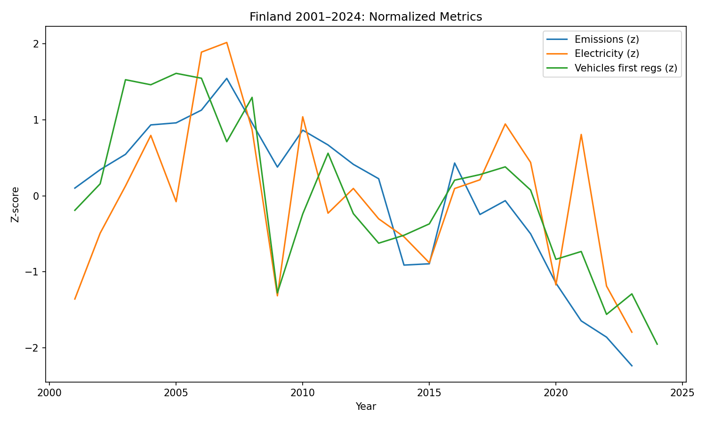
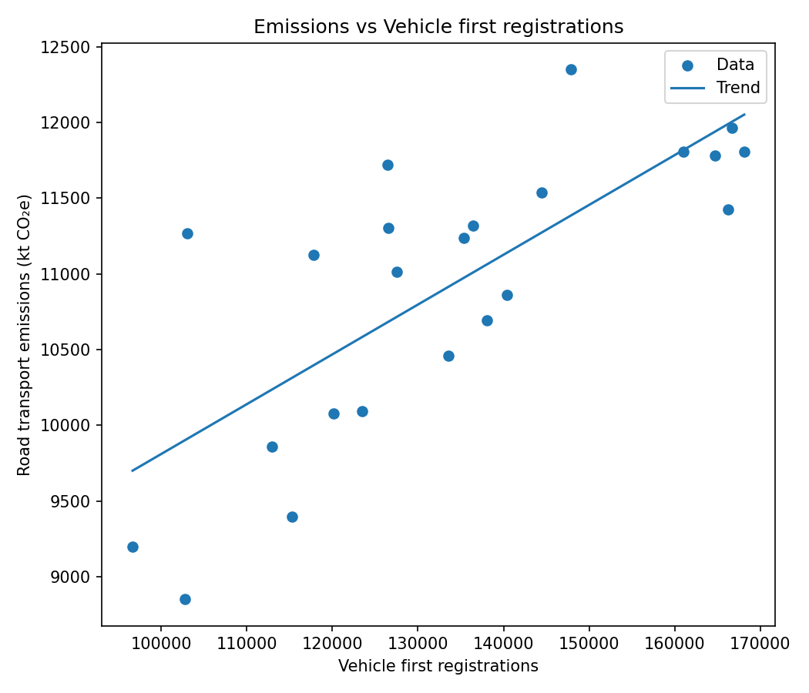
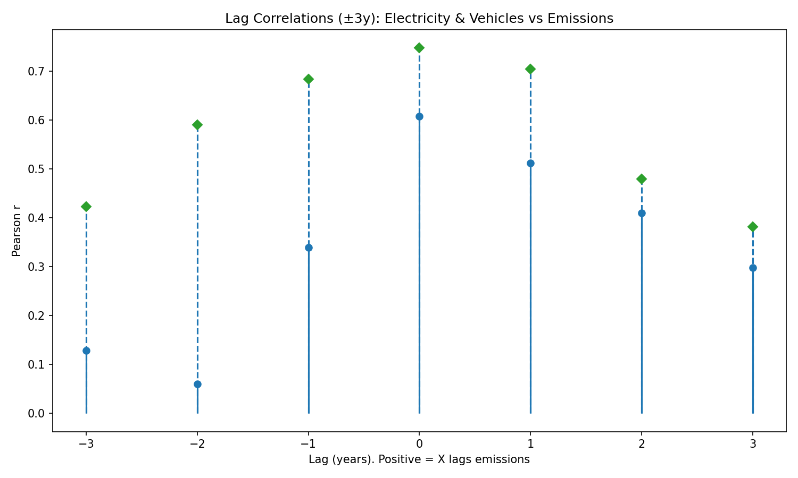

# Mobility-Energy-Emissions-in-Finland-2001-2024
This project analyzes how road-transport emissions in Finland (2001–2024) relate to vehicle registrations and national electricity demand, using open Statistics Finland (StatFin) data. It builds a reproducible Python pipeline for preprocessing, statistical analysis, and visualization.

---

## Setup & Run

### Create a virtual environment

**Windows (PowerShell)**

```
py -3 -m venv .venv
.\.venv\Scripts\Activate.ps1
python -m pip install --upgrade pip
python -m pip install -r requirements.txt
````

**macOS / Linux**
```
python -m venv .venv
source .venv/bin/activate
python -m pip install --upgrade pip
python -m pip install -r requirements.txt
```

## Data Sources
All datasets are from **Statistics Finland (StatFin)**, licensed under [CC BY 4.0](https://creativecommons.org/licenses/by/4.0/):

### 2) Place data files

Add these StatsFin CSV exports to the `dataset/` folder:  
- Greenhouse_gas_emissions.csv  
- Electricity_consumption.csv  
- Reg_vehicles.csv  

Encodings handled internally: UTF-8 for emissions; Latin-1 for electricity and vehicles.  
Files have two preamble lines before headers.

### 3) Run the pipeline

**1) Parse and merge**
```
python src/preprocess.py --data-dir dataset --out-dir results
```

**2) Analytics (correlations, lag/rolling, OLS)**
```
python src/analysis.py --in-csv results/merged_finland_2001_2024.csv --out-dir results
```

**3) Plots**
```
python src/visualization.py --in-csv results/merged_finland_2001_2024.csv --out-dir results/figures
```
---

## What the Code Does (Succinct)

1. **src/preprocess.py**
Filters road transportation emissions (kt CO₂e), selects total electricity consumption (GWh), extracts all automobiles (Mainland Finland first registrations), and merges by year (2001–2024).

2. **src/analysis.py**
Computes z-scores and year-over-year deltas, Pearson correlations (levels and deltas), 5-year rolling correlations, ±3-year lag correlations, and runs OLS regressions:  
- emissions_ktco2e ~ electricity_gwh + vehicles_first_reg  
- d_emissions ~ d_electricity + d_vehicles

3. **src/visualization.py**
Saves five figures: time series, two scatter plots with trendlines, rolling correlations, and lag correlations.

---

## Core Results

### Time Series (Normalized)
<div align="center">
  
</div>

Emissions peaked around the mid-2000s and have steadily declined since the 2010s. Electricity use and vehicle registrations moved up and down more freely. After roughly **2015**, emissions started falling even while electricity and registrations stayed flat, a clear sign of **decoupling** between transport activity and CO₂ output.

---

### Emissions vs Electricity
<div align="center">
  
</div>

- There’s a weak upward trend but a lot of scatter.
- The OLS model shows **electricity use isn’t a significant factor** (p ≈ 0.29).
- In simple terms, total grid electricity doesn’t directly explain transport emissions in Finland.

---

### Emissions vs Vehicle First Registrations
<div align="center">
  
</div>

Here, the relationship is much stronger and cleaner. The OLS results show **vehicle registrations are statistically significant** (coef ≈ 0.027, p = 0.004). That means years with more new cars on the road are strongly associated with higher transport emissions.

---

### 5-Year Rolling Correlations
<div align="center">
  
</div>

- **Emissions ↔ Electricity:** generally positive but dipped between 2020–2022.  
- **Emissions ↔ Vehicles:** mostly strong and positive, with a brief drop during the late-2000s crisis years.

These changing patterns show how **policy shifts and new technologies** periodically reshape the relationship between travel, power, and pollution.

---

### Lag Correlations (±3 Years)
<div align="center">
  
</div>

Both electricity (~0.6) and vehicles (~0.75) line up best at **lag = 0**. So neither variable leads the other, they move together in the same year.
Transport emissions react almost immediately to changes in activity levels.

---

### OLS Regression (Levels and Deltas)
📄 [Read full OLS summary](results/ols_summary.txt)

**Levels model:**  
- R² = 0.584 (Adj R² = 0.542)  
- Vehicles significant (p = 0.004)  
- Electricity not significant (p = 0.288)

**Year-over-Year Changes:**  
- R² = 0.251 (Adj R² = 0.172)  
- ΔElectricity marginal (p ≈ 0.073)  
- ΔVehicles not significant

**In Words:** 
New vehicle activity explains overall emission levels, but short-term jumps or dips in electricity or registrations don’t drive yearly emission swings. This pattern matches **Finland’s fuel efficiency improvements and early EV adoption** after 2015.

---

### Summary Takeaway
Transport emissions in Finland are still tied to how many cars hit the road, but the link between overall energy demand and emissions is fading. Cleaner cars and better technology are helping emissions drop, even as electricity use and vehicle numbers fluctuate.

---

## Interpretation and Outcomes

Emissions are clearly decoupling from electricity use and vehicle registrations. In other words, road-transport emissions are falling even though energy use and new vehicle activity continue to vary. This likely reflects cleaner technologies, better fuel efficiency, and the growing share of hybrids and electric vehicles.

Total electricity demand, however, doesn’t directly explain transport emissions. It’s too broad to capture EV adoption or charging behavior accurately. To understand electrification effects, future work should include EV stock and charging data.

Overall, Finland’s open data systems make this kind of transparent, reproducible climate analysis possible, a strong example of how digital data supports environmental accountability.

---

## Limitations

- Vehicle metric = first registrations (activity proxy). Consider total vehicle stock, vehicle-kilometres, or fuel sales.  
- Electricity metric = total consumption, not transport-specific. Add EV charging load and grid CO₂ intensity.  
- Small sample size (2001–2024): complement p-values with structural break or Bayesian models.

---

## Extensions (Next Commits)

- Integrate EV registrations/stock and biofuel share; re-estimate models.  
- Include electricity mix CO₂ intensity to separate electrification from grid greening.  
- Add a Streamlit app for interactive exploration.  
- Add GitHub Actions to auto-run the pipeline and publish figures to GitHub Pages.

---

## Troubleshooting

Activate virtual environment:
```
.\.venv\Scripts\Activate.ps1
```
Install dependencies:
```
python -m pip install -r requirements.txt
```
If vehicle headers differ (e.g., “2001 number”), adjust the regex in `load_vehicles()` to match the header.

---

## Citation

Zareen Rahman (2025). *Mobility–Energy–Emissions in Finland (2001–2024):  
A Reproducible Analysis of Road-Transport Emissions.*

---

## License

MIT

---

## Acknowledgements
Data © Statistics Finland (StatFin), used under CC BY 4.0.  
Analytical design and visualization by Zareen Rahman (2025).
